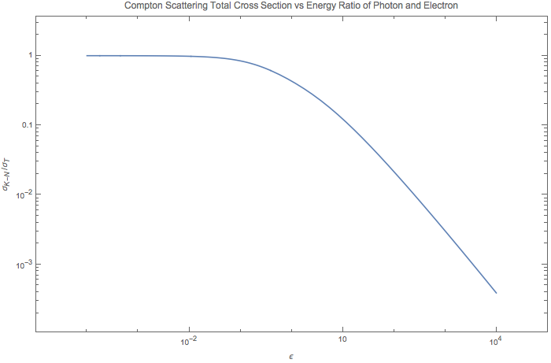

Photon Production
=====================

There are two important processes that produces photons in astrophysical environment, namely thermal Bremsstrahlung and synchrotron radiation.

Bremsstrahlung Radiation
---------------------------

.. figure:: astrophysics/assets/thermalBremsstrahlungSpectrum.png
   :align: center

   This is the spectrum of frequency-dependent emissivity of the process which happens when a flux of non-relativistic regime with thermal distributon of temperature T is shot into a plasma of ions or protons.

Compton Scattering
----------------------

The quantities we are interested in are cross section and radiated power, both of which are Lorentz invariant.

Thomson Scattering
~~~~~~~~~~~~~~~~~~~

Total cross section of Thomson scattering can be obtained using only classical electrodynamics. The physics behind it is that the electric field excerts force on an electron then the electron emits photons to all possible direction as it oscillates.

The incoming power per unit area is

.. math::
   P_{inc}= c u_{rad},

as :math:`u_{rad} = \frac{E^2}{4\pi}` is the energy density of EM field.

The outgoing or scattered wave power (total) is

.. math::
   P_{scatt} = \frac{2}{3}\frac{e^4}{m_e^2 c^3} E^2.

The total cross section is ratio of the two quantity, i.e.,

.. math::
   \sigma_T \equiv \frac{P_{scatt}}{P_{inc}} =\frac{8\pi e^4}{3 m_e ^2 c^4} = \frac{8\pi (\alpha \hbar c)^2}{3 m_e ^2 c^4},

in which the fine structure constant is defined as :math:`\alpha = \frac{e^2}{\hbar c}`. 

Compton Scattering
~~~~~~~~~~~~~~~~~~~~~

The full quantum electrodynamics result is called Klein-Nishima formula, which describes the total cross section of coliding photon and electron,

.. math::
   \sigma_{K-N} = \frac{\pi e^4}{m_e^2 c^4} \frac{1}{\epsilon} \left[ \left(1 - \frac{2(\epsilon+1)}{\epsilon^2}\right) \ln (2\epsilon + 1) + \frac{1}{2} + \frac{4}{\epsilon} - \frac{1}{2(2\epsilon + 1)^2} \right],

where :math:`\epsilon = \frac{E}{m_e c^2}`.

In the limit that energy of electron is much larger than photons, we have :math:`\epsilon` is much smaller than 1, we would come back to the Thomson limit, which is true for our equation,

.. math::
   \sigma_{K-N} &= \sigma_T \frac{3 \left(\left(1-\frac{2 (x+1)}{x^2}\right) \log (2 x+1)+\frac{4}{x}-\frac{1}{2 (2 x+1)^2}+\frac{1}{2}\right)}{8 x} \\
   & = \sigma_T (1 - 2\epsilon + O(x^2)).

To have more understanding on this formula, I ploted :math:`\sigma_{K-N}` in terms of :math:`\sigma_T` as the energy scale :math:`\epsilon` changes.

Refs & Notes
----------------

